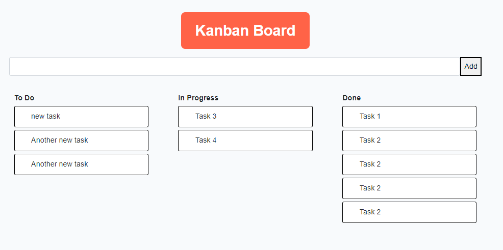
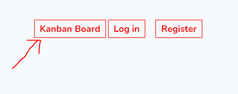
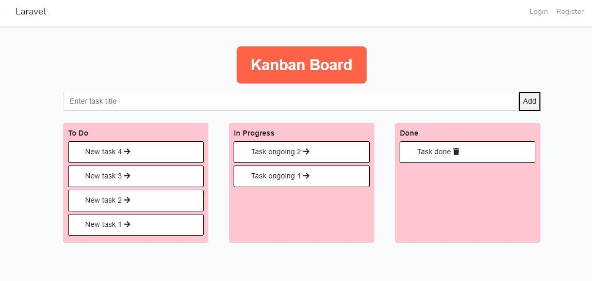

  
# Kanban Board

- Technology Used : Laravel-8, Bootstrap-4, Vue.js 2
#

- Click Kanban board link

-- add new task 

## Setup

	- Clone site
	- composer install
	- npm install
	- npm run dev
	- php artisan key:generate
	- php artisan migrate
	- php artisan migrate:fresh --seed
	- php artisan serve

